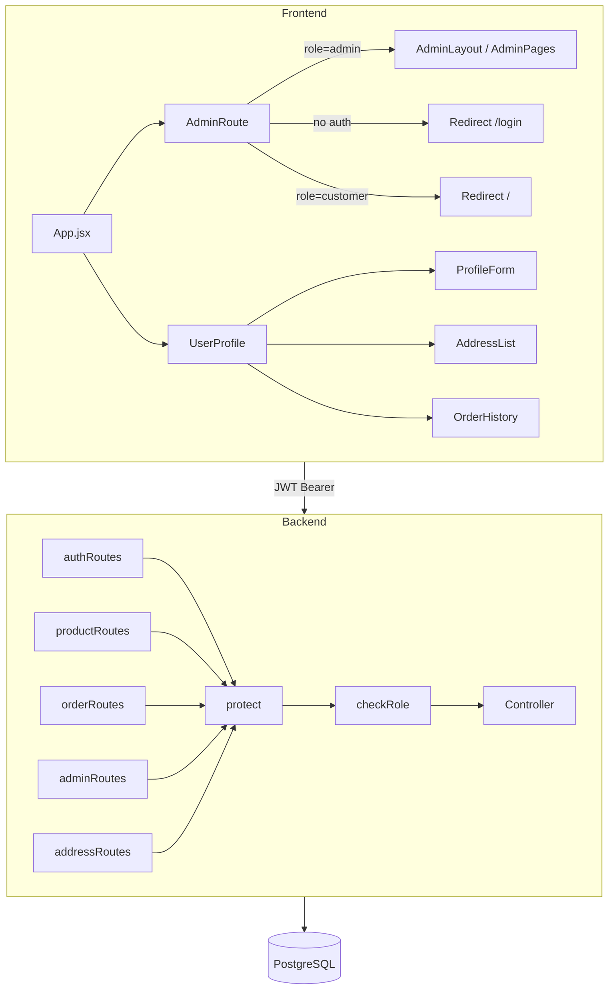

# Design Document — Visualmind MVP Completion

## Overview

Este documento describe el diseño técnico para completar el MVP de Visualmind, cubriendo cuatro áreas:

1. **Protección de rutas admin en el Backend** — middleware `checkRole` aplicado a todos los endpoints sensibles
2. **Protección de rutas admin en el Frontend** — componente `AdminRoute` que guarda las rutas `/admin/*`
3. **Perfil de usuario completo** — edición de perfil, CRUD de direcciones, historial de pedidos
4. **Schema SQL actualizado** — sin referencias a Supabase, con todas las tablas reales
5. **Variables de entorno** — `.env.example` documentados y validación al arrancar

El stack es Node.js + Express 5 / PostgreSQL en el backend y React 19 + Vite / React Router 7 en el frontend. La autenticación usa JWT almacenado en `localStorage`.

---

## Architecture



El flujo de autorización en el backend sigue siempre la cadena: `protect` → `checkRole(role)` → controller. El frontend usa `AdminRoute` como wrapper de React Router que inspecciona el contexto de autenticación antes de renderizar.

---

## Components and Interfaces

### Backend

#### `authMiddleware.js` — `checkRole(role)`

```js
// Nuevo export a añadir en backend/middleware/authMiddleware.js
export const checkRole = (role) => (req, res, next) => {
  if (req.user?.role !== role) {
    return res.status(403).json({ message: `Acceso denegado: se requiere rol ${role}` });
  }
  next();
};
```

`protect` ya existe y decodifica el JWT en `req.user`. `checkRole` se usa siempre después de `protect`.

#### Rutas que requieren `protect + checkRole('admin')`

| Ruta | Archivo | Cambio |
|------|---------|--------|
| `POST /api/products` | `productRoutes.js` | Añadir `protect, checkRole('admin')` |
| `PUT /api/products/:id` | `productRoutes.js` | Añadir `protect, checkRole('admin')` |
| `DELETE /api/products/:id` | `productRoutes.js` | Añadir `protect, checkRole('admin')` |
| `GET /api/orders/all` | `orderRoutes.js` | Reemplazar `protect` por `protect, checkRole('admin')` |
| `PUT /api/orders/:id/status` | `orderRoutes.js` | Añadir `checkRole('admin')` |
| `GET /api/admin/stats` | `adminRoutes.js` | Añadir `checkRole('admin')` |
| `POST /api/auth/promote` | `authRoutes.js` | Añadir `checkRole('admin')` |

#### `authController.js` — `updateMe`

Nuevo handler para `PUT /api/auth/me`:

```js
export const updateMe = async (req, res) => {
  const { full_name, email } = req.body;
  // 1. Si viene email, verificar que no esté en uso por otro usuario
  // 2. UPDATE users SET full_name=$1, email=$2 WHERE id=$3 RETURNING ...
  // 3. Retornar usuario actualizado
};
```

#### `addressController.js` (nuevo archivo)

Handlers: `getAddresses`, `createAddress`, `updateAddress`, `deleteAddress`.

Todos verifican que `address.user_id === req.user.id` antes de modificar/eliminar (HTTP 403 si no coincide).

#### `addressRoutes.js` (nuevo archivo)

```
GET    /api/addresses          → protect, getAddresses
POST   /api/addresses          → protect, createAddress
PUT    /api/addresses/:id      → protect, updateAddress
DELETE /api/addresses/:id      → protect, deleteAddress
```

Registrar en `server.js`:
```js
import addressRoutes from '../routes/addressRoutes.js';
app.use('/api/addresses', addressRoutes);
```

### Frontend

#### `AdminRoute.jsx` (nuevo componente)

Ubicación: `frontend/src/components/AdminRoute.jsx`

```jsx
import { Navigate } from 'react-router-dom';
import { useAuth } from '../context/AuthContext';

export default function AdminRoute({ children }) {
  const { user, loading } = useAuth();

  if (loading) return <div className="loading-spinner" />;
  if (!user) return <Navigate to="/login" replace />;
  if (user.role !== 'admin') return <Navigate to="/" replace />;

  return children;
}
```

`AuthContext` debe exponer `loading` (ya existe) y `user` con campo `role`.

#### `App.jsx` — Envolver rutas admin

```jsx
import AdminRoute from './components/AdminRoute';

// Dentro de <Routes>:
<Route path="/admin" element={
  <AdminRoute>
    <AdminLayout />
  </AdminRoute>
}>
  <Route index element={<AdminDashboard />} />
  <Route path="products" element={<AdminProducts />} />
  <Route path="orders" element={<AdminOrders />} />
  <Route path="settings" element={<AdminSettings />} />
</Route>
```

#### `UserProfile.jsx` — Tres secciones

La página se divide en tres secciones independientes:

1. **ProfileForm** — formulario con `full_name` y `email`, llama `PUT /api/auth/me`
2. **AddressList** — lista de direcciones con botones Agregar / Editar / Eliminar, llama `/api/addresses`
3. **OrderHistory** — lista de pedidos con número, fecha, total, estado y productos, llama `GET /api/orders/my`

Si `user` es null, redirige a `/login` con `<Navigate to="/login" replace />`.

---

## Data Models

### `users`
```sql
id           UUID PRIMARY KEY DEFAULT gen_random_uuid()
email        VARCHAR(255) UNIQUE NOT NULL
password_hash VARCHAR(255) NOT NULL
full_name    VARCHAR(255)
role         VARCHAR(50) DEFAULT 'customer'
created_at   TIMESTAMPTZ DEFAULT NOW()
```

### `products`
```sql
id             UUID PRIMARY KEY DEFAULT gen_random_uuid()
title          VARCHAR(255) NOT NULL
description    TEXT
price          DECIMAL(10,2) NOT NULL
category       VARCHAR(100)
sub_category   VARCHAR(100)
parent_category VARCHAR(100)
image_url      VARCHAR(500)
sku            VARCHAR(100) UNIQUE
stock          INTEGER DEFAULT 0
is_new         BOOLEAN DEFAULT false
discount       DECIMAL(5,2) DEFAULT 0
featured       BOOLEAN DEFAULT false
new_arrival    BOOLEAN DEFAULT false
launch_date    DATE
created_at     TIMESTAMPTZ DEFAULT NOW()
```

### `product_variants`
```sql
id         UUID PRIMARY KEY DEFAULT gen_random_uuid()
product_id UUID REFERENCES products(id) ON DELETE CASCADE NOT NULL
size       VARCHAR(20)
color      VARCHAR(50)
stock      INTEGER DEFAULT 0
sku        VARCHAR(100)
created_at TIMESTAMPTZ DEFAULT NOW()
```

### `orders`
```sql
id                       UUID PRIMARY KEY DEFAULT gen_random_uuid()
user_id                  UUID REFERENCES users(id) ON DELETE SET NULL
items                    JSONB NOT NULL
total                    DECIMAL(10,2) NOT NULL
status                   VARCHAR(50) DEFAULT 'pending'
stripe_payment_intent_id VARCHAR(255)
created_at               TIMESTAMPTZ DEFAULT NOW()
```

### `order_items`
```sql
id                UUID PRIMARY KEY DEFAULT gen_random_uuid()
order_id          UUID REFERENCES orders(id) ON DELETE CASCADE NOT NULL
product_id        UUID REFERENCES products(id) ON DELETE SET NULL
variant_id        UUID REFERENCES product_variants(id) ON DELETE SET NULL
quantity          INTEGER NOT NULL
price_at_purchase DECIMAL(10,2) NOT NULL
```

### `shipping_addresses`
```sql
id           UUID PRIMARY KEY DEFAULT gen_random_uuid()
user_id      UUID REFERENCES users(id) ON DELETE CASCADE NOT NULL
full_name    VARCHAR(255) NOT NULL
address_line VARCHAR(500) NOT NULL
city         VARCHAR(100) NOT NULL
province     VARCHAR(100)
postal_code  VARCHAR(20)
country      VARCHAR(100) DEFAULT 'Panama'
is_default   BOOLEAN DEFAULT false
created_at   TIMESTAMPTZ DEFAULT NOW()
```

### `stock_logs`
```sql
id         UUID PRIMARY KEY DEFAULT gen_random_uuid()
product_id UUID REFERENCES products(id) ON DELETE CASCADE NOT NULL
variant_id UUID REFERENCES product_variants(id) ON DELETE SET NULL
change     INTEGER NOT NULL
reason     TEXT
created_at TIMESTAMPTZ DEFAULT NOW()
```

### `coupons`
```sql
id               UUID PRIMARY KEY DEFAULT gen_random_uuid()
code             VARCHAR(50) UNIQUE NOT NULL
discount_percent DECIMAL(5,2) NOT NULL
max_uses         INTEGER
used_count       INTEGER DEFAULT 0
expires_at       TIMESTAMPTZ
created_at       TIMESTAMPTZ DEFAULT NOW()
```

---

## Correctness Properties

*A property is a characteristic or behavior that should hold true across all valid executions of a system — essentially, a formal statement about what the system should do. Properties serve as the bridge between human-readable specifications and machine-verifiable correctness guarantees.*

### Property 1: checkRole rechaza roles incorrectos

*For any* usuario autenticado cuyo `role` no coincide con el rol requerido, `checkRole(requiredRole)` debe responder con HTTP 403 y el mensaje de acceso denegado.

**Validates: Requirements 2.1, 2.2**

---

### Property 2: AdminRoute redirige según estado de autenticación

*For any* estado de autenticación (no autenticado, autenticado con rol `customer`, autenticado con rol `admin`), `AdminRoute` debe renderizar el contenido protegido solo cuando `user.role === 'admin'`, y redirigir en cualquier otro caso.

**Validates: Requirements 3.1, 3.2, 3.3**

---

### Property 3: Actualización de perfil es idempotente en datos válidos

*For any* usuario autenticado y cualquier payload válido de `{ full_name, email }` donde el email no esté en uso por otro usuario, llamar `PUT /api/auth/me` debe retornar HTTP 200 con los datos actualizados, y una segunda llamada con los mismos datos debe producir el mismo resultado.

**Validates: Requirements 4.1, 4.2**

---

### Property 4: Round-trip de direcciones

*For any* usuario autenticado y cualquier dirección válida, crear una dirección con `POST /api/addresses` y luego listarlas con `GET /api/addresses` debe incluir la dirección recién creada con los mismos datos.

**Validates: Requirements 4.4**

---

### Property 5: Historial de pedidos contiene todos los campos requeridos

*For any* pedido en el historial del usuario, el componente `OrderHistory` debe renderizar: número de orden, fecha, total, estado, y al menos un producto de la lista de items.

**Validates: Requirements 4.8**

---

## Error Handling

### Backend

| Situación | HTTP | Mensaje |
|-----------|------|---------|
| Token ausente | 401 | `"No autorizado, no hay token"` |
| Token inválido/expirado | 401 | `"No autorizado, token fallido"` |
| Rol insuficiente | 403 | `"Acceso denegado: se requiere rol admin"` |
| Email ya en uso (updateMe) | 409 | `"El email ya está en uso"` |
| Dirección no pertenece al usuario | 403 | `"No tienes permiso para modificar esta dirección"` |
| Variable de entorno crítica faltante | — | Error en startup, proceso termina con `process.exit(1)` |
| Error interno de BD | 500 | `"Error en el servidor"` |

### Validación de entorno al arrancar

En `server.js`, antes de `app.listen`:

```js
const REQUIRED_ENV = ['JWT_SECRET', 'DATABASE_URL'];
for (const key of REQUIRED_ENV) {
  if (!process.env[key]) {
    console.error(`❌ Variable de entorno requerida no definida: ${key}`);
    process.exit(1);
  }
}
```

### Frontend

- `AdminRoute` muestra spinner mientras `loading === true` para evitar redirecciones falsas
- `UserProfile` redirige a `/login` si `user` es null
- Errores de API en `UserProfile` se muestran con mensajes inline (no crashes)
- Errores de actualización de perfil/dirección se muestran junto al formulario correspondiente

---

## Testing Strategy

### Enfoque dual: unit tests + property-based tests

Los unit tests cubren ejemplos concretos, casos borde y puntos de integración. Los property tests verifican propiedades universales sobre rangos de inputs generados.

### Unit Tests (ejemplos y casos borde)

**Backend:**
- `checkRole('admin')` con usuario admin → llama `next()`
- `checkRole('admin')` con usuario customer → responde 403
- `checkRole('admin')` sin `req.user` → responde 403
- `PUT /api/auth/me` con email duplicado → responde 409
- `DELETE /api/addresses/:id` con dirección de otro usuario → responde 403
- `GET /api/orders/all` sin token → responde 401
- `GET /api/orders/all` con token de customer → responde 403
- Startup sin `JWT_SECRET` → proceso termina con error

**Frontend:**
- `AdminRoute` con `loading=true` → renderiza spinner, no redirige
- `AdminRoute` con `user=null` → renderiza `<Navigate to="/login">`
- `AdminRoute` con `user.role='customer'` → renderiza `<Navigate to="/">`
- `AdminRoute` con `user.role='admin'` → renderiza children
- `UserProfile` con `user=null` → renderiza `<Navigate to="/login">`
- `UserProfile` renderiza formulario de perfil con campos `full_name` y `email`
- `UserProfile` renderiza lista de direcciones con botones de acción

### Property-Based Tests

Librería recomendada: **fast-check** (compatible con Jest/Vitest, disponible para Node.js y browser).

Configuración mínima: **100 iteraciones** por propiedad.

Cada test debe incluir un comentario de trazabilidad:
```
// Feature: visualmind-mvp-completion, Property N: <texto de la propiedad>
```

**Property 1 — checkRole rechaza roles incorrectos**
```
// Feature: visualmind-mvp-completion, Property 1: checkRole rechaza roles incorrectos
// Para cualquier rol de usuario distinto al requerido, debe responder 403
fc.assert(fc.property(
  fc.string().filter(r => r !== 'admin'),
  (userRole) => { /* mock req.user.role = userRole, call checkRole('admin'), expect 403 */ }
), { numRuns: 100 });
```

**Property 2 — AdminRoute redirige según estado**
```
// Feature: visualmind-mvp-completion, Property 2: AdminRoute redirige según estado de autenticación
// Para cualquier combinación de user/loading, AdminRoute debe comportarse correctamente
```

**Property 3 — Actualización de perfil idempotente**
```
// Feature: visualmind-mvp-completion, Property 3: Actualización de perfil es idempotente en datos válidos
// Para cualquier full_name y email válido no duplicado, PUT /api/auth/me retorna 200 con datos actualizados
```

**Property 4 — Round-trip de direcciones**
```
// Feature: visualmind-mvp-completion, Property 4: Round-trip de direcciones
// Para cualquier dirección válida, POST luego GET debe incluir la dirección creada
```

**Property 5 — Historial de pedidos contiene campos requeridos**
```
// Feature: visualmind-mvp-completion, Property 5: Historial de pedidos contiene todos los campos requeridos
// Para cualquier pedido generado, el render debe incluir id, fecha, total, status e items
```
